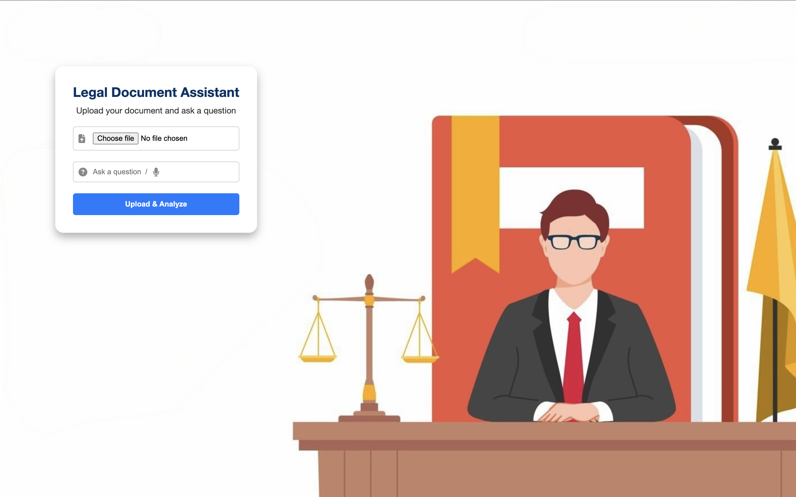

# 📝 **Legal Document Assistant** 🧑‍⚖️

Welcome to the **Legal Document Assistant**! This is a powerful web application that leverages AI to help users extract insights from legal documents. Whether you're a lawyer, a legal professional, or anyone dealing with legal text, this tool can help you quickly summarize documents and even answer specific questions about them.



## 🛠️ **Features**

- **Document Upload:** Easily upload various document formats (PDF, DOCX, etc.).
- **AI Text Extraction:** Extract text from your uploaded document using AI-powered methods.
- **Summarization:** Get a concise summary of the legal document.
- **Question Answering:** Ask questions about the document, and receive AI-powered answers.
- **Interactive Animations:** Enjoy a fun character animation that visually represents the document analysis process.

## 🖥️ **Technologies Used**

This project combines modern web technologies with cutting-edge AI models:

- **Frontend:**
  - **HTML, CSS, JavaScript**: For structuring, styling, and adding interactivity to the web pages.
  - **Bootstrap**: To ensure the site is responsive and user-friendly across all devices.
  - **Animate.css**: For smooth and interactive animations.
  
- **Backend:**
  - **Django**: The powerful Python web framework to build the server-side of the application.
  - **Python**: The programming language used for AI logic, including text extraction, summarization, and question answering.
  - **Custom AI Models**: For document text extraction, summarization, and question answering. 
  - **Celery**: For handling background tasks and processing documents asynchronously.
  
- **AI Core:**
  - **Text Extraction**: Extract text from documents like PDF, DOCX.
  - **Summarization Model**: AI-powered model to summarize lengthy legal documents.
  - **QA Model**: Ask questions about the document content and get precise AI answers.

## ⚙️ **Installation Guide**

Follow these steps to get the project up and running on your local machine.

### 1. Clone the Repository

Start by cloning the repository to your local machine:

```bash
git clone https://github.com/thisisanimesh01/legal_document_assistant.git
cd legal_document_assistant
